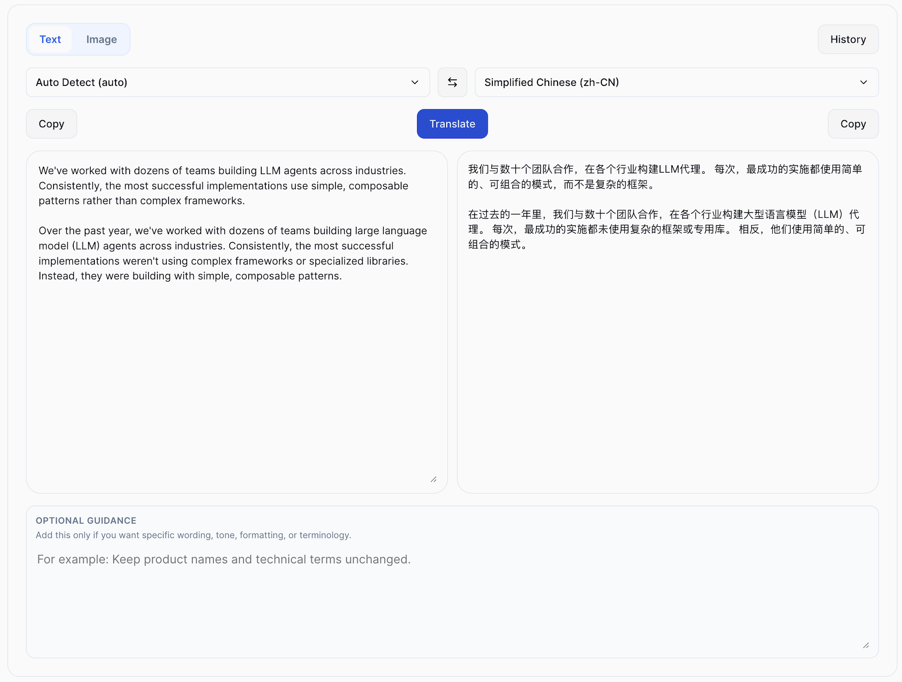
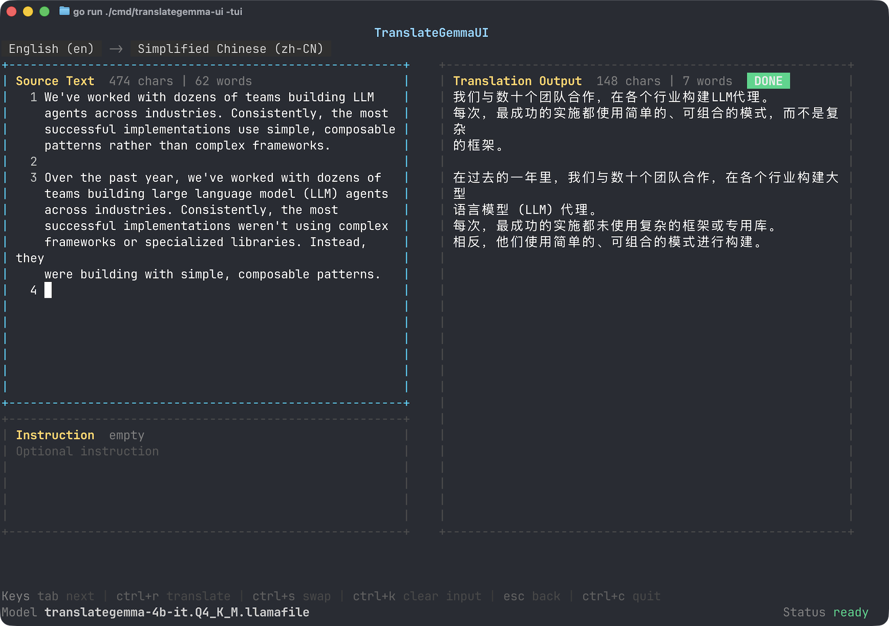

# TranslateGemmaUI

TranslateGemmaUI is a local TranslateGemma app with:

- a Go CLI entrypoint
- Bubble Tea TUI mode
- an embedded Web UI served from the same binary
- local model download and activation flows
- streaming text translation output
- image translation for multimodal runtimes

The app downloads packaged TranslateGemma runtimes from Hugging Face on demand and stores them under the user data directory. End users do not need Go or Bun if they install from GitHub Releases or Homebrew.

## Screenshots

### Web UI

Local text and image translation in the embedded browser interface.



### TUI

Keyboard-first translation workflow powered by Bubble Tea.



## Platform Support

Release binaries are published for:

- macOS `amd64`
- macOS `arm64`
- Linux `amd64`
- Linux `arm64`
- Windows `amd64`

Homebrew installation is supported on macOS and Linux only.
Windows users should install from the GitHub Releases page.

## Install

### Option 1: GitHub Release

Download the latest archive from [GitHub Releases](https://github.com/xzhih/translategemma-ui/releases).

Expected artifacts:

- `translategemma-ui_<version>_darwin_amd64.tar.gz`
- `translategemma-ui_<version>_darwin_arm64.tar.gz`
- `translategemma-ui_<version>_linux_amd64.tar.gz`
- `translategemma-ui_<version>_linux_arm64.tar.gz`
- `translategemma-ui_<version>_windows_amd64.zip`

### Option 2: Homebrew

Tap this repository and install the formula:

```bash
brew tap xzhih/translategemma-ui https://github.com/xzhih/translategemma-ui
brew install xzhih/translategemma-ui/translategemma-ui
```

## Quick Start

### Run the Web UI

```bash
translategemma-ui --webui
```

Open [http://127.0.0.1:8090](http://127.0.0.1:8090).

To let another local app or a different frontend call the service, keep the server running and point it at the same listen address. If you need access from another device on your LAN, start it with:

```bash
translategemma-ui --webui --listen 0.0.0.0:8090
```

### Run the TUI

```bash
translategemma-ui --tui
```

### Run the Desktop App

The repository now includes a Tauri desktop shell under `desktop/`. It starts the existing Go Web UI as a bundled sidecar and opens it in a native desktop window, so end users do not need to launch a browser manually.

For local development:

```bash
cd desktop
bun install
bun run dev
```

To build a desktop bundle on the current platform:

```bash
cd desktop
bun run build
```

### Check the version

```bash
translategemma-ui --version
```

### Manage runtimes from the CLI

```bash
translategemma-ui models list
translategemma-ui models download --id q4_k_m
translategemma-ui models delete --id q4_k_m
```

### Translate text from the CLI

```bash
translategemma-ui translate text \
  --text "Hello world" \
  --source-lang en \
  --target-lang zh-CN
```

### Translate an image from the CLI

```bash
translategemma-ui translate image \
  --file /path/to/image.png \
  --model-id q8_0_vision
```

## External Translation API

TranslateGemmaUI exposes translation endpoints that can be used by third-party apps, browser UIs, or automation scripts.

Base URL when running locally:

- `http://127.0.0.1:8090`

Available endpoints:

- `POST /api/translate` for single-shot text translation
- `POST /api/translate/stream` for streaming text translation
- `POST /api/translate/image` for multipart image translation when the active runtime supports vision
- `GET /healthz` for a simple health check

`/api/translate*` and `/healthz` send permissive CORS headers and answer `OPTIONS` preflight requests, so browser-based clients from another origin can call them directly.

Text endpoints accept either `application/json` or `application/x-www-form-urlencoded` payloads. Use `source_lang`, `target_lang`, `translation_instruction`, and either `input_text` or `text`. If `source_lang` is omitted it defaults to `auto`; if `target_lang` is omitted it defaults to `zh-CN`.

Example JSON translation request:

```bash
curl http://127.0.0.1:8090/api/translate \
  -H 'Content-Type: application/json' \
  -d '{
    "source_lang": "en",
    "target_lang": "zh-CN",
    "input_text": "Hello world",
    "translation_instruction": "Use concise UI wording."
  }'
```

Example response:

```json
{
  "ok": true,
  "output": "你好，世界",
  "message": "Translation completed",
  "messageCode": "translation_completed",
  "history": {
    "id": 1,
    "source": "en",
    "target": "zh-CN",
    "input": "Hello world",
    "output": "你好，世界",
    "when": "09:27:54"
  },
  "count": 1
}
```

Example streaming request:

```bash
curl http://127.0.0.1:8090/api/translate/stream \
  -H 'Content-Type: application/json' \
  -d '{
    "source_lang": "ja",
    "target_lang": "en",
    "text": "こんにちは"
  }'
```

For successful streaming requests, the response is newline-delimited JSON with `status`, `progress`, `delta`, `error`, and `done` event types. Method errors or malformed payloads return regular HTTP error responses instead of an event stream.

Image translation uses `multipart/form-data` with an `image_file` field plus optional `source_lang`, `target_lang`, and `translation_instruction` fields. It accepts JPEG, PNG, and GIF uploads up to 10 MB. If the active runtime does not support vision, the endpoint returns `active_runtime_no_image_support`.

## Runtime Model Source

Default runtime source:

- Hugging Face repo: [xzhih/translategemma-4b-it-llamafile](https://huggingface.co/xzhih/translategemma-4b-it-llamafile)
- Manifest URL: `https://huggingface.co/xzhih/translategemma-4b-it-llamafile/resolve/main/manifest-v1.json`

Current runtime matrix:

- `q4_k_m` for text translation
- `q6_k` for text translation
- `q8_0` for text translation
- `q8_0_vision` for text and image translation

## Data Directory

Default data directory:

- macOS / Linux: `$HOME/.translategemma-ui`
- Windows: `%USERPROFILE%\\.translategemma-ui`

Created structure:

```text
<user-home>/.translategemma-ui/
  config.json
  history.json
  state.json
  logs/
  runtimes/
  tmp/
```

Downloaded runtimes are stored under `runtimes/`.
On Windows, packaged `.llamafile` runtimes are saved locally with an `.exe` suffix for direct execution compatibility.

## Development

Development requirements:

- Go 1.25+
- Bun 1.2+
- Rust 1.77.2+ for the Tauri desktop shell

Install frontend dependencies:

```bash
cd webui
bun install
```

Install desktop shell dependencies:

```bash
cd desktop
bun install
```

Run backend tests:

```bash
go test ./...
```

Build the desktop sidecar without starting the desktop shell:

```bash
cd desktop
bun run build:sidecar
```

Run frontend tests:

```bash
cd webui
bun run test
```

Run the Vite dev server:

```bash
cd webui
bun run dev -- --host 127.0.0.1 --port 5173
```

Run the backend in another terminal:

```bash
go run ./cmd/translategemma-ui --webui
```

The Vite dev server proxies `/api/*` and `/healthz` to `http://127.0.0.1:8090`, so the local backend needs to be running while you work on the frontend.

Build a local release binary:

```bash
./tools/build_release.sh
```

Build local cross-platform binaries:

```bash
./tools/build_release_all.sh
```

Outputs:

- `dist/translategemma-ui-darwin-amd64`
- `dist/translategemma-ui-darwin-arm64`
- `dist/translategemma-ui-linux-amd64`
- `dist/translategemma-ui-linux-arm64`
- `dist/translategemma-ui-windows-amd64.exe`

The Web UI is embedded into the Go binary from `internal/web/frontend/`.
If you changed files under `webui/`, run `./tools/sync_webui_dist.sh` before a manual `go build`.

## Release Process

Tagged releases use GoReleaser through `.github/workflows/release.yml`.

Release flow:

1. push `main`
2. create and push a tag like `v0.1.0`
3. GitHub Actions runs tests, builds release archives, uploads release assets, and updates `Formula/translategemma-ui.rb`

## Troubleshooting

- Runtime logs: `<user-home>/.translategemma-ui/logs/runtime.log`
- If local runtime startup fails, make sure the local backend port is free and at least one packaged runtime is installed
